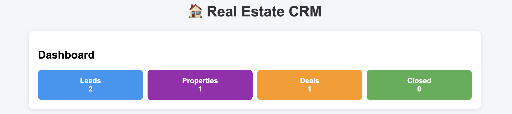
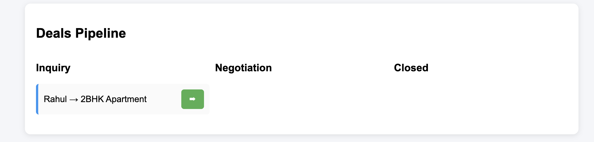
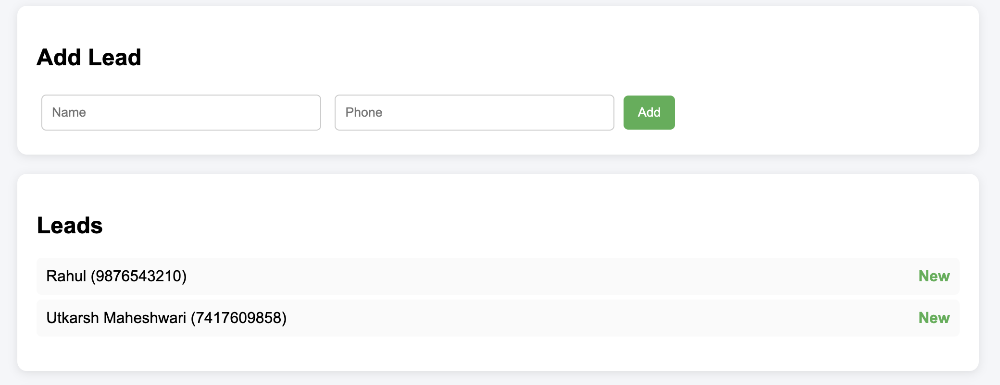

# 🏠 Real Estate CRM System

A full-stack CRM application for managing real estate leads, properties, and deal pipelines.

---

## 🚀 Features

* Lead Management
* Property Management
* Deal Pipeline (Inquiry → Negotiation → Closed)
* Dashboard Analytics

---

## 🛠 Tech Stack

* Node.js
* Express.js
* MongoDB (Local)
* HTML, CSS, JavaScript

---

## ⚙️ How to Run Locally

### 1. Clone the repository

git clone https://github.com/YOUR_USERNAME/real-estate-crm.git

### 2. Install dependencies

npm install

### 3. Start MongoDB locally

Make sure MongoDB is running on your system

### 4. Start the server

npx nodemon server.js

### 5. Open in browser

http://localhost:5000

---

## 🧠 System Flow

1. Add Leads
2. Add Properties
3. Create Deals
4. Move deals across stages
5. Track metrics via dashboard

---

## 📸 Screenshots

### Dashboard

### Deal Pipeline

### Leads & Properties

---

## 📌 Note

This project is built as an MVP focusing on core CRM workflows.

---

## 👨‍💻 Author

Utkarsh Maheshwari
